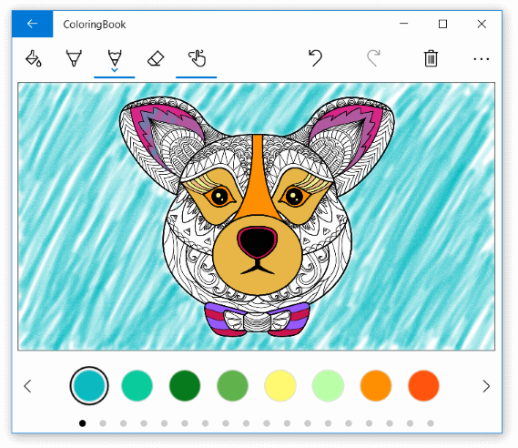

<!---
  category: CustomUserInteractions Inking Printing FilesFoldersAndLibraries
-->

# Coloring Book sample

A mini-app that demonstrates the versatility of Windows Ink (including the Windows Ink Toolbar)
and radial controller (for Wheel devices such as the Surface Dial) features.
 
> Note - This sample is targeted and tested for Windows 10, version 1903 (10.0; Build 18362), and Visual Studio 2019. If you prefer, you can use project properties to retarget the project(s) to Windows 10, version 1809 (10.0; Build 17763), and/or open the sample with Visual Studio 2017.

Using the extensive customization features provided by the inking and radial controller APIs, 
this sample app incorporates coloring book functionality (line art, standard inking tools such 
as pen and pencil), a custom Ink Toolbar that features additional tools (flood fill, 
touch inking, undo/redo), and a fully customized standalone color palette containing 
a much more extensive collection of colors.

## Features

The Coloring Book sample includes the following features:

* Windows Ink with improved ink rendering performance using the custom ink drying APIs
* Windows Ink Toolbar with various customizations
* RadialController support and customizations
* Ink strokes constrained to predefined regions (boundaries specified by the line art)
* Flood fill of predefined regions
* Ink stroke erase and ink region erase
* Ink undo and redo
* Custom color palette 
* Print support
* Share and Export
* Autosave
* Process and add your own line art to the collection of coloring projects

This sample does not cover Windows Ink Analysis.

## March 2018 update

The current version of this sample includes extensive architecture, code, and functional improvements
over the previous version. These updates necessarily make the sample more complicated. For a simpler inking 
sample, see [Coloring Book V1](https://github.com/Microsoft/Windows-appsample-coloringbook/releases/tag/v1.0).

## Universal Windows Platform development

### Prerequisites

- Windows 10. Minimum: Windows 10, version 1809 (10.0; Build 17763), also known as the Windows 10 October 2018 Update.
- [Windows 10 SDK](https://developer.microsoft.com/windows/downloads/windows-10-sdk). Minimum: Windows SDK version 10.0.17763.0 (Windows 10, version 1809).
- [Visual Studio 2019](https://visualstudio.microsoft.com/downloads/) (or Visual Studio 2017). You can use the free Visual Studio Community Edition to build and run Windows Universal Platform (UWP) apps.

To get the latest updates to Windows and the development tools, and to help shape their development, join 
the [Windows Insider Program](https://insider.windows.com).

## Running the sample

There are two projects in the VS solution for this sample:

* ColoringBook (default) - the actual coloring book app.
* ColoringBookPreprocessingGenerator - a utility for processing your own line art for use in the ColoringBook app.

You can Start Debugging (F5) or Start Without Debugging (Ctrl+F5) to try it out. The app will run in the emulator or on physical devices.

**Note:** The platform target currently defaults to ARM, so be sure to change that to x64 or x86 if you want to test on a non-ARM device. 

## Code at a glance

### Custom dry ink rendering canvas

By default, ink input is processed on a low-latency background thread and rendered "wet" as it is drawn. When the stroke is completed (pen or finger lifted, or mouse button released), the stroke is processed on the UI thread and rendered "dry" to the [InkCanvas](https://docs.microsoft.com/uwp/api/windows.ui.xaml.controls.inkcanvas) layer (above the application content and replacing the wet ink).
Windows Ink enables you to override this behavior and completely customize the inking experience by custom drying the ink input and providing more efficient management of large, or complex, collections of ink strokes. For example code, see [ColoringPage.xaml](ColoringBook/Views/ColoringPage.xaml#L25), [ColoringPage.xaml.cs](ColoringBook/Views/ColoringPage.xaml.cs#L25), and [ColoringPageController.cs](ColoringBook/Views/ColoringPageController.cs#L25).

To resolve ink rendering issues when a user zooms in or out (or for any change in display DPI), we adjust the DPI scale of the dry ink canvas in in the [ColoringPage.ScrollViewer_ViewChanged method](ColoringBook/Views/ColoringPage.xaml.cs#L185).

### Custom InkToolbar

* Flood fill tool.
* Custom pen and pencil tools with stroke size slider and stroke graphic (exposed to developers), and color palette removed and replaced with custom palette described later.
* Custom eraser button with two eraser modes: stroke erase and cell erase.
* Touch inking.
* See [ColoringBookInkToolbar.xaml](ColoringBook/Views/ColoringBookInkToolbar.xaml#L25) and [ColoringBookInkToolbar.xaml.cs](ColoringBook/Views/ColoringBookInkToolbar.xaml.cs#L25).

### Custom color palette

* More extensive set of default colors.
* Always visible.
* Rich color picker on press and hold (or right button click for mouse).
* See [ColorPalette.xaml](ColoringBook/Views/ColorPalette.xaml#L25) and [ColorPalette.xaml.cs](ColoringBook/Views/ColorPalette.xaml.cs#L25).

### Surface Dial (Wheel device) support

* Default InkToolbar integration.
* Custom Undo/Redo ink back stack.
* See [RadialControlHelper.cs](ColoringBook/Components/RadialControlHelper.cs#L25).

### Undo/Redo

* Each operation uses a StartTransaction() call -> [operations] -> EndTransaction() process, which enables multiple operations to go into one Undo/Redo back stack item.
* Each operation implements the [IUndoRedoOperation](ColoringBook/UndoRedoOperations/Operation.cs#L50) interface.
* See [UndoRedo.cs](ColoringBook/UndoRedoOperations/UndoRedo.cs#L25).

### Autosave

* A 500 ms timer is started when a specific operation completes (such as inking, eraser, undo/redo).
* After the timer completes, and it has not been restarted by a new operation, the save function is called.
* See [ColoringPageController.cs](ColoringBook/Views/ColoringPageController.cs#L91).

### Printing

* Derived from the [Windows printing sample](https://github.com/Microsoft/Windows-universal-samples/tree/master/Samples/Printing).
* See [PhotoPrintHelper.cs](ColoringBook/Components/PhotoPrintHelper.cs#L25).

### Sharing and export

* For exporting as a png file, we use [RenderTargetBitmap](https://docs.microsoft.com/uwp/api/windows.ui.xaml.media.imaging.rendertargetbitmap) to create an image of the combined content of a XAML visual tree (the ColoringCanvas object in this sample). This eliminates the need to manually composite the different layers of the canvas.
* For sharing we use the standard UWP [Share contract](https://docs.microsoft.com/windows/uwp/app-to-app/share-data).
* See [ColoringExporter.cs](ColoringBook/Models/ColoringExporter.cs#L25).

### Ink canvas

Each ColoringBook coloring page is composed of 4 layers:

1. The top layer is the line art image to be colored. This sits on top of everything to ensure ink does not cover the black lines of the image.
2. The second layer is the wet ink canvas where ink is rendered as it’s drawn, but is not dried.

**Important:** The ink strokes are encapsulated in a [SwapChainPanel](https://docs.microsoft.com/uwp/api/windows.ui.xaml.controls.swapchainpanel). This creates a more complex composition tree where the ink input is not rendered on the top layer (the image) but is instead directly associated with the [InkCanvas](https://docs.microsoft.com/uwp/api/windows.ui.xaml.controls.inkcanvas).

3. The third layer is the dry canvas where the wet ink strokes are dried. Once a stroke has been dried it is removed from the wet ink canvas.
4. Finally, the bottom layer is where flood fill changes are applied. This is a [WriteableBitmap](https://docs.microsoft.com/uwp/api/windows.ui.xaml.media.imaging.writeablebitmap) image.

### Inking within cells

The ColoringBook sample includes a default set of line art images that have been pre-processed to identify coloring regions. The region boundaries are derived from the lines in the images and are used to constrain inking to the active region.
Users can draw individual ink strokes with the pen or pencil tools, or use the flood fill tool for more immediate gratification. Once inking has started in a region, strokes are not rendered outside the boundary of that region.

## Adding your own artwork

This sample includes the ColoringBookPreprocessingGenerator project, which is the utility we built to process line art for use in the ColoringBook app. You can use this utility for your own line art.

1. In a single folder, create your line art images. 
We recommend greyscale images of two sizes: 2000 x 1125 for default resolution and 4000 x 2250 for high resolution.
2. Name them *imagename*.png and *imagename*HighResolution.png, respectively.
3. Create a thumbnail image from your original images by creating a copy of your original image and resizing it to 255 x 127.
4. Rename this file to *imagename*.thumbnail. 
5. Build and run the ColoringBookPreprocessingGenerator project.
6. Process your line art images. There are two processing options:
  a. Convert white to transparent in image. This converts whites and grays to their corresponding opacity value for a png image. This is necessary to ensure the background of the coloring image is transparent for seeing the layers of the coloring canvas under the source image.
  b. Generate Preprocessing - this creates the cell dictionary that maps co-ordinates to cells.
7. Add the output directory to the ColoringBook project under Assets/LibraryImages.

## Known issues

**Issue:** Ink bleeding into other regions when coloring near a boundary  
**Reason:** Clipping ink points as they cross a boundary is not a trivial task and is beyond the scope of this sample.

## See also

### Windows Ink

* [Pen interactions and Windows Ink in UWP apps](https://docs.microsoft.com/windows/uwp/input-and-devices/pen-and-stylus-interactions)
* [Ink tutorial](https://docs.microsoft.com/windows/uwp/get-started/ink-walkthrough) and related 
[sample](https://github.com/Microsoft/Windows-tutorials-inputs-and-devices/tree/master/GettingStarted-Ink)
* [InkCanvas class](https://docs.microsoft.com/uwp/api/windows.ui.xaml.controls.inkcanvas)
* [InkToolbar class](https://docs.microsoft.com/uwp/api/windows.ui.xaml.controls.inktoolbar)
* [InkPresenter class](https://docs.microsoft.com/uwp/api/windows.ui.input.inking.inkpresenter)

### RadialController

* [Surface Dial interactions](https://docs.microsoft.com/windows/uwp/input-and-devices/windows-wheel-interactions)
* [RadialController tutorial](https://docs.microsoft.com/windows/uwp/get-started/radialcontroller-walkthrough)
and related [sample](https://github.com/Microsoft/Windows-tutorials-inputs-and-devices/tree/master/GettingStarted-RadialController)
* [RadialController class](https://docs.microsoft.com/uwp/api/Windows.UI.Input.RadialController)

### Other inking samples

* [Simple ink sample (C# and C++)](https://github.com/Microsoft/Windows-universal-samples/tree/master/Samples/SimpleInk)
* [Ink Analysis (C#)](https://github.com/Microsoft/Windows-universal-samples/tree/master/Samples/InkAnalysis)
* [Complex ink sample (C++)](https://github.com/Microsoft/Windows-universal-samples/tree/master/Samples/ComplexInk)
* [Ink sample (JavaScript)](https://github.com/Microsoft/Windows-universal-samples/tree/master/Samples/Ink)

