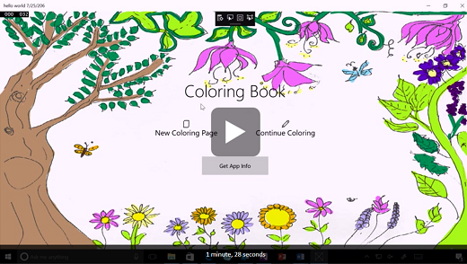
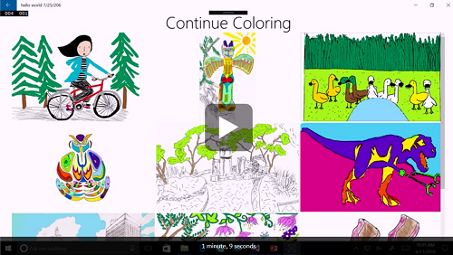

<!---
  category: CustomUserInteractions Inking Printing TrialsAdsAndInAppPurchases FilesFoldersAndLibraries
-->

# Coloring Book UWP app sample

A mini-app that explores Windows Ink and Monetization features using the Windows Store.
Specifically, it allows users to purchase coloring page collections and
then color with Windows Ink. This sample runs on the Universal Windows Platform (UWP). 

## Features

Coloring Book demonstrates:

* Using the Windows.Services.Store API for managing in-app purchases
* Customizing Windows Ink experiences with custom tools and pages
* Saving Windows Ink onto an image using [Win2D](https://www.nuget.org/packages/Win2D.uwp)
* Manipulating Windows Ink with other files to save, open, export, share, and print

## UWP development

This sample requires Visual Studio 2015 and the Windows Software
Development Kit (SDK) for Windows 10 Anniversary. [Get a free copy of
Visual Studio 2015 Community Edition](https://www.visualstudio.com/)
with support for building UWP apps. Additionally, to be informed of the
latest updates to Windows and the development tools, join the Windows
Insider Program.

## Running the sample

The default project is ColoringBook, and you can Start Debugging (F5) or
Start Without Debugging (Ctrl+F5) to try it out. The app will run in the
emulator or on physical devices.

To enable the in-app purchases code:

1.  Follow the [instructions to test in-app
    purchases](https://msdn.microsoft.com/windows/uwp/monetize/in-app-purchases-and-trials#testing-apps-that-use-the-windows-services-store-namespace)
    to get a Package.StoreAssociation.
2.  Add storeIds in Constants.cs
3.  \#define STOREASSOCIATION in PickColoringPage.cs

## Code at a glance

If you’re just interested in code snippets for certain API and don’t
want to browse or run the full sample, check out the following files for
examples of some highlighted features:

In-app purchases:

* [PickColoringPage.xaml.cs](ColoringBook/PickColoringPage.xaml.cs#L25) verifies if the coloring page collection
    has been purchased, and if not, allows the user to purchase
    the collection.
* [Constants.cs](ColoringBook/Constants.cs#L25) maintains a dictionary of the storeIds associated the
    coloring page collections.

Windows Ink:

* [ColoringPage.xaml.cs](ColoringBook/ColoringPage.xaml.cs#L25) handles all Windows Ink data and actions.
* [ColoringPage.xaml](ColoringBook/ColoringPage.xaml#L25) contains the layout of a coloring page.
* [MarkerPen.cs](ColoringBook/MarkerPen.cs#L25) defines a pen that draws as a highlighter.

Printing:

* Printing uses the [UWP Community Toolkit](http://www.nuget.org/packages/Microsoft.Toolkit.Uwp/) print helper.
* UWP Community Toolkit print helper source can be seen on [GitHub](https://github.com/Microsoft/UWPCommunityToolkit/blob/master/Microsoft.Toolkit.Uwp/Helpers/PrintHelper/PrintHelper.cs)
    – ColoringPage sends UWP Toolkit PrintHelper an image to print.

## See also

[Monetize documentation](https://developer.microsoft.com/store/monetize)  
[Pen and stylus documentation](https://msdn.microsoft.com/windows/uwp/input-and-devices/pen-and-stylus-interactions)  
